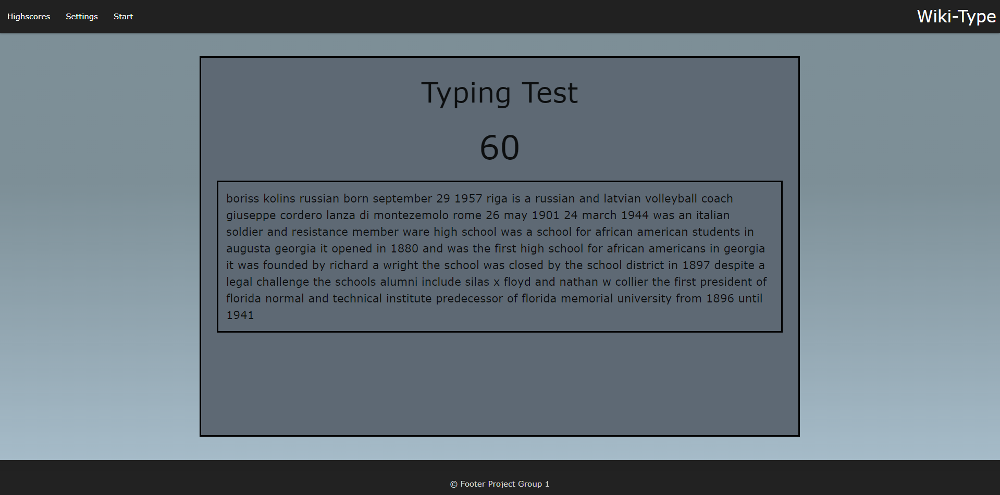
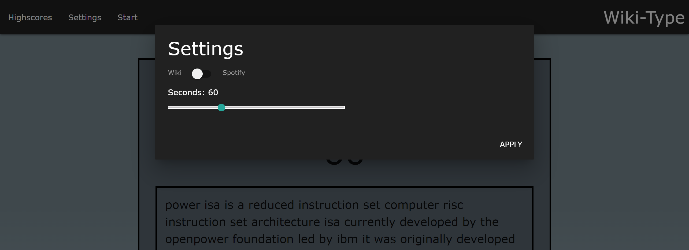
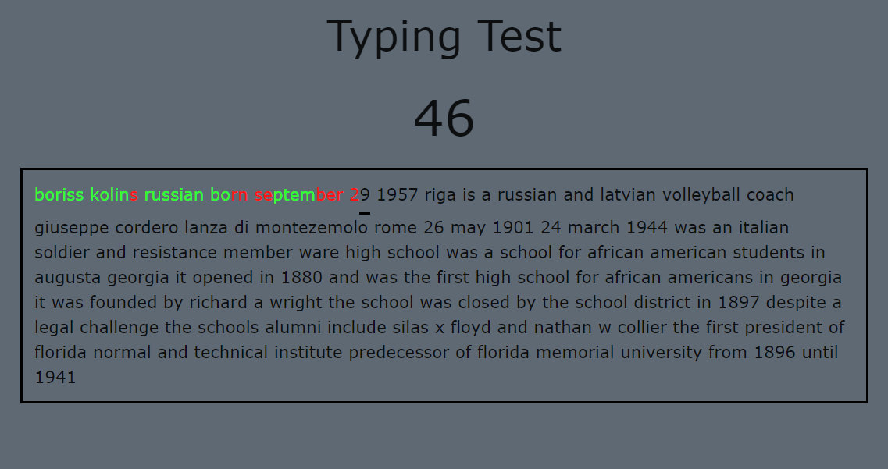
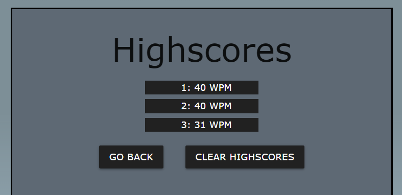

# WIKI-TYPE SPEED TEST APPLICATION

Visit the website at: https://calebjwood.github.io/Wiki-Type/

## User Story ##
AS A user looking to practice typing skills

I WANT to test my typing speed with real-world text examples

SO THAT I can improve it

## Acceptance Criteria ##
GIVEN I am looking for a way to test my typing skills

WHEN I click 'settings'

THEN I am provided with test customization options

WHEN I click 'start game' (or simply start typing)

THEN the timer will begin to count down

WHEN the game begins

THEN the letters will respond to my keystrokes

WHEN I get a letter correct

THEN the letter turns green and I cannot use the backspace key

WHEN I get a letter incorrect

THEN the letter turns red, and I may either backspace and try again or continue typing

WHEN the timer reaches zero

THEN my words per minute score is displayed

WHEN I click the 'High Scores" button

THEN I am presented with the scores as they relate to my device

## Resources
* Spotify Web API: https://developer.spotify.com/documentation/web-api
* MediaWiki API: https://www.mediawiki.org/wiki/API:Main_page
* Materialize CSS: https://materializecss.com/getting-started.html
* jQuery API: https://api.jquery.com/

## Technologies Used

This application deploys a number of techniques, a variety of formulas, and a healthy dose of the Materialize CSS library and jQuery. We also used Visual Studio Code as a code editor, Git workflow, and GitHub.

## APIs
We call heavily on two APIs -- Media Wiki and Spotify -- for our text content.

Through Media Wiki, we get random paragraph clippings from random articles all strung together, with an only-text property. No punctuation, no capital letters, singly spaced.

Through Spotify Web API, we retrieve random lyrics for the typing game. The API provides a substantial amount of content metadata, categorized by albums, artists, tracks, lyrics and more. However, our focus for this project is solely on the lyrics.

## Materialize CSS
The Materialize framework played a big role in this application. Just about everything from the linear gradient behind the body of the page itself to the styling of the 'Settings' window that appears, from color inspiration to even the components included *in* said 'Settings' window, this framework was a very useful tool.

Chief among the value provided by Materialize are the dynamically-created class assignments. While taking the test, a correct response renders a bright green font, while an incorrect response renders bright red.

## Words per Minute 

Once the timer reaches zero, a simple equation is run to determine the number of strokes that were implemented. That number is divided by 4.7 -- the average length of a word in the English language -- and then '60' is divided by the selected length of the time-slider. 

This score is automatically displayed onscreen and recorded in the "High Scores" tab.

